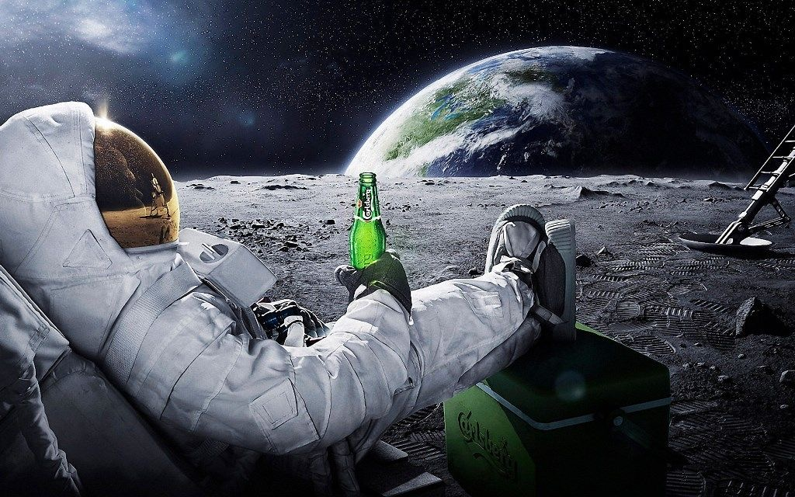
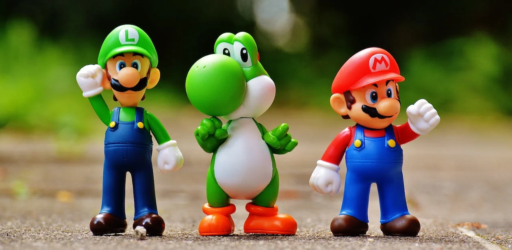
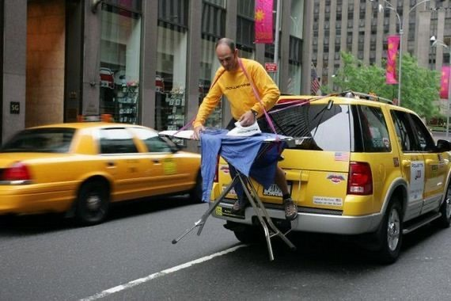

# Cerule - A <span style="color: #4285F4;">Tiny</span> <span style="color: #DB4437;">Mighty</span> <span style="color: #F4B400;">Vision</span> <span style="color: #0F9D58;">Model</span>
### Based on Google's - <span style="color: #D56c76;">Gemma-2b + SigLIP</span>


```
 ██████╗███████╗██████╗ ██╗   ██╗██╗     ███████╗
██╔════╝██╔════╝██╔══██╗██║   ██║██║     ██╔════╝
██║     █████╗  ██████╔╝██║   ██║██║     █████╗  
██║     ██╔══╝  ██╔══██╗██║   ██║██║     ██╔══╝  
╚██████╗███████╗██║  ██║╚██████╔╝███████╗███████╗
 ╚═════╝╚══════╝╚═╝  ╚═╝ ╚═════╝ ╚══════╝╚══════╝                                                               
 ```                                                               


                        


We train and release "Cerule", a tiny yet powerful Vision Lanuage Model based on the newly released Google's [Gemma-2b](https://huggingface.co/google/gemma-2b) and Google's [SigLIP](https://huggingface.co/google/siglip-so400m-patch14-384). 


The training setup was `4xA100's 80GB` and took ~6 hours to pretrain and ~13 hours to finetune. We modify and adapt the training code from [Bunny](https://github.com/BAAI-DCAI/Bunny). 

---
| Image | Example |
|-------|---------|
|  | **Describe the image**<br>The image is a playful and surreal depiction of a man in a space suit, sitting on a chair and holding a green beer bottle. The man is wearing a white space suit, complete with a helmet and gloves. His feet are clad in black and white shoes, and he is placed on a sandy surface. The background features a large, blue planet, with a moon and a star visible in the sky. |
|  | **Who are the characters in the image?**<br>The image features three characters, two of them are Mario and Luigi, and the third one is Yoshi.<br><br>**Describe the actions of the characters**<br>The Mario and Luigi characters are holding their arms out, as if they are waving. Yoshi is standing on its own, with its arms folded. |
|  | **What's funny about this image?**<br>The image is quite humorous as it depicts a man ironing clothes on the back of a yellow taxi cab. This is not a typical sight you'd expect to see in everyday life. |
---


## Training

Before running the training, you need to install the following dependencies:

* Create a conda env:
```
conda create -n cerule python=3.10
conda activate cerule
```
* Basic requirements
```
pip install --upgrade pip
pip install transformers
pip install torch torchvision xformers --index-url https://download.pytorch.org/whl/cu118
```

* Instal Apex. Please install from source, as the package on pypi is not related to this.
```
pip install ninja
git clone https://github.com/NVIDIA/apex
cd apex
pip install -v --disable-pip-version-check --no-cache-dir --no-build-isolation --global-option="--cpp_ext" --global-option="--cuda_ext" ./
# https://github.com/Dao-AILab/flash-attention?tab=readme-ov-file#installation-and-features
```
* Install flash-attention
```
pip install packaging
pip install flash-attn --no-build-isolation
```
* Install Cerule and other requirements
```
git clone https://github.com/Tensoic-AI/Cerule
cd Cerule
pip install -e .
```

### Pretrain

* Data preparation
  We use the following Dataset prepared by the amazing folks at [Beijing Academy of Artificial Intelligence](https://huggingface.co/BAAI)
  The dataset is available [here](https://www.modelscope.cn/datasets/BoyaWu10/Bunny-v1.0-data).

  Pretrain Dataset format:
  ```
  {
        "conversations": [
            {
                "from": "human",
                "value": "<image>\nProvide a brief description of the given image."
            },
            {
                "from": "gpt",
                "value": "A set of three chrome and bubble glass table lamp bases. H.50cm - Image 4 of 10"
            }
        ],
        "id": "0006418798",
        "image": "0006418798.jpg"
    },
  ```

* Run

  Update `--model_name_or_path` and `--vision_tower` to the paths of the LLM and vision encoder, respectively. Update `MODEL_TYPE` and `OUTPUT_DIR` accordingly.

  ```shell
  sh script/train/pretrain.sh
  ```

### Visual Instruction Tuning

* Data preparation

  We also utilize Bunny-695K a modified version of [SVIT-mix-665K](https://arxiv.org/abs/2307.04087) for finetuning by BAAI.
  The dataset is available [here](https://www.modelscope.cn/datasets/BoyaWu10/Bunny-v1.0-data).

* Run

  Update `--model_name_or_path` and `--vision_tower` to the paths of the LLM and vision encoder, respectively. Update `MODEL_TYPE`, `PRETRAIN_DIR` and `OUTPUT_DIR` accordingly. The global batch size is 128.
  
  ```shell
  # full-parameter tuning
  sh script/train/finetune_full.sh
  
  # LoRA tuning
  sh script/train/finetune_lora.sh
  ```


## Inference
#### For a CLI based inference:
```
python3 -m cerule.serve.cli \
	--model-path /path/to/cerule/model \
	--image-file examples/astronaut.png
```

## License
Licensed under the Apache License, Version 2.0 http://www.apache.org/licenses/LICENSE-2.0. This file may not be copied, modified, or distributed except according to those terms.

## Contribution
Unless you explicitly state otherwise, any contribution intentionally submitted for inclusion in the work by you, as defined in the Apache-2.0 license, shall be licensed as above, without any additional terms or conditions.

## Acknowledgements
We sincerely thank the Amazing teams at Google, LLaVA, and BAAI without which this project would not have been possible!

## Star History

<a href="https://star-history.com/#tensoic/Cerule&Date">
 <picture>
   <source media="(prefers-color-scheme: dark)" srcset="https://api.star-history.com/svg?repos=tensoic/Cerule&type=Date&theme=dark" />
   <source media="(prefers-color-scheme: light)" srcset="https://api.star-history.com/svg?repos=tensoic/Cerule&type=Date" />
   
 </picture>
</a>


